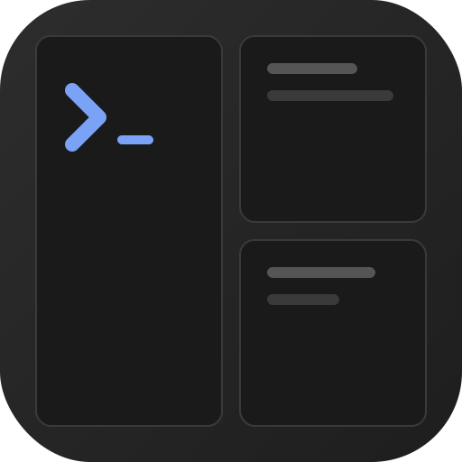

<p align="centre">
  
</p>

<h1 align="centre">cmux-web</h1>

<p align="centre">
  A web-based terminal multiplexer — <a href="https://github.com/nichochar/cmux">cmux</a> for the browser.
</p>

<p align="centre">
  
  
  
</p>

---

Split panes, multiple workspaces, resizable layouts — all running in your browser with real PTY sessions on the backend. Powered by [ghostty-web](https://github.com/nichochar/ghostty-web) for terminal rendering and [Bun](https://bun.sh) for the server runtime.

## Features

- **Split panes** — horizontal and vertical splits with drag-to-resize handles
- **Multiple workspaces** — create, switch, and close workspaces from the sidebar
- **Real PTY sessions** — full terminal emulation with proper shell integration
- **Mobile-first** — slide-over sidebar, swipe navigation, single-pane mode on small screens
- **CLI control** — cmux-compatible Unix socket for scripting and automation
- **Lightweight** — vanilla JS frontend, no build step for the client

## Quick Start

```bash
# Install dependencies
bun install

# Start the dev server
bun run dev
```

Open [http://localhost:7681](http://localhost:7681) in your browser.

## Installation

### From source

```bash
git clone https://github.com/jinbe/cmux-web.git
cd cmux-web
bun install
bun run build
bun run start
```

### Requirements

- [Bun](https://bun.sh) ≥ 1.0
- macOS or Linux (PTY support via `bun-pty`)

## Architecture

```
┌─────────────────────────────────────────┐
│            Browser (Frontend)            │
│  ┌─────────────┐  ┌─────────────┐      │
│  │ ghostty-web │  │ ghostty-web │      │
│  │   Pane 1    │  │   Pane 2    │      │
│  └──────┬──────┘  └──────┬──────┘      │
│         └───── WebSocket ────────┐      │
└──────────────────────────────────┼──────┘
                                   │
┌──────────────────────────────────┼──────┐
│            Server (Bun)          │      │
│       ┌──────────────────────────┘      │
│       │  Session Manager                │
│  ┌────┴────┐  ┌─────────┐              │
│  │  PTY 1  │  │  PTY 2  │  ...         │
│  └─────────┘  └─────────┘              │
│                                         │
│  CLI Socket (/tmp/cmux-web.sock)        │
└─────────────────────────────────────────┘
```

| Component | Path | Description |
|---|---|---|
| **Server** | `src/server/` | Express + WebSocket server, PTY manager, session manager |
| **Client** | `public/` | Vanilla JS with ghostty-web, split layout renderer |
| **CLI** | `src/cli/` | Commander-based CLI via Unix domain socket |
| **Shared** | `src/shared/` | Protocol types shared between server, client, and CLI |

## Usage

### Keyboard Shortcuts

| Shortcut | Action |
|---|---|
| `Ctrl+Shift+N` | New workspace |
| `Ctrl+1–9` | Switch workspace by number |
| `Ctrl+Shift+D` | Split right |
| `Ctrl+Shift+E` | Split down |
| `Ctrl+Shift+W` | Close focused pane |
| `Escape` | Close sidebar / actions menu |

### CLI

The CLI communicates with the server via a Unix domain socket, using the same JSON protocol as [cmux](https://github.com/nichochar/cmux) v2.

```bash
# Check server is running
bun run cli -- ping

# Workspace management
bun run cli -- workspace list
bun run cli -- workspace create --name "My Project"
bun run cli -- workspace select <id>
bun run cli -- workspace close <id>

# Surface (pane) management
bun run cli -- surface list
bun run cli -- surface split <surfaceId> --direction right
bun run cli -- surface split <surfaceId> --direction down
bun run cli -- surface close <surfaceId>
bun run cli -- surface send-text <surfaceId> "echo hello"

# Quick split (uses current workspace)
bun run cli -- split --direction down
```

### Mobile Support

Works on phones and tablets out of the box:

- **Slide-over sidebar** — swipe right from the left edge
- **Single-pane mode** on small screens with swipe between surfaces
- **Touch-draggable** resize handles
- **Toolbar** with workspace name, surface pips, and actions menu
- **Safe area** support for notched devices
- **PWA-ready** — add to home screen for a native app feel

## Configuration

| Environment Variable | Default | Description |
|---|---|---|
| `CMUX_WEB_PORT` | `7681` | HTTP/WebSocket server port |
| `CMUX_WEB_SOCKET_PATH` | `/tmp/cmux-web.sock` | CLI control socket path |

## cmux Compatibility

The CLI socket speaks the same newline-delimited JSON protocol as cmux v2:

```json
{"id":"1","method":"workspace.list","params":{}}
{"id":"1","ok":true,"result":{"workspaces":[...]}}
```

Existing cmux integrations can be adapted to talk to cmux-web by setting `CMUX_WEB_SOCKET_PATH`.

## Development

```bash
# Run dev server with hot reload
bun run dev

# Run tests
bun test

# Type-check
bun run typecheck

# Build for production
bun run build

# Start production server
bun run start
```

### Project Structure

```
cmux-web/
├── public/              # Static frontend (vanilla JS)
│   ├── css/style.css    # Styles
│   ├── js/
│   │   ├── app.js       # Main app + workspace management
│   │   ├── layout-renderer.js  # Split pane renderer
│   │   └── ws-client.js # WebSocket client
│   └── index.html
├── src/
│   ├── server/          # Bun server
│   │   ├── index.ts     # Entry point
│   │   ├── session-manager.ts  # Workspace/surface state
│   │   ├── pty-manager.ts      # PTY lifecycle
│   │   ├── ws-handler.ts       # WebSocket message handler
│   │   └── cli-socket.ts       # Unix domain socket for CLI
│   ├── cli/             # CLI tool
│   │   ├── index.ts     # Commands
│   │   └── client.ts    # Socket client
│   └── shared/          # Shared types
│       └── protocol.ts  # Message types + constants
├── scripts/
│   └── build.ts         # Production build script
└── package.json
```

## Contributing

Contributions are welcome! Please open an issue first to discuss what you'd like to change.

1. Fork the repository
2. Create a feature branch (`git checkout -b feat/my-feature`)
3. Make your changes and add tests
4. Run `bun test` and `bun run typecheck`
5. Commit with [conventional commits](https://www.conventionalcommits.org/) (`feat:`, `fix:`, etc.)
6. Open a pull request

## Licence

[MIT](LICENCE) © Jin Chan
